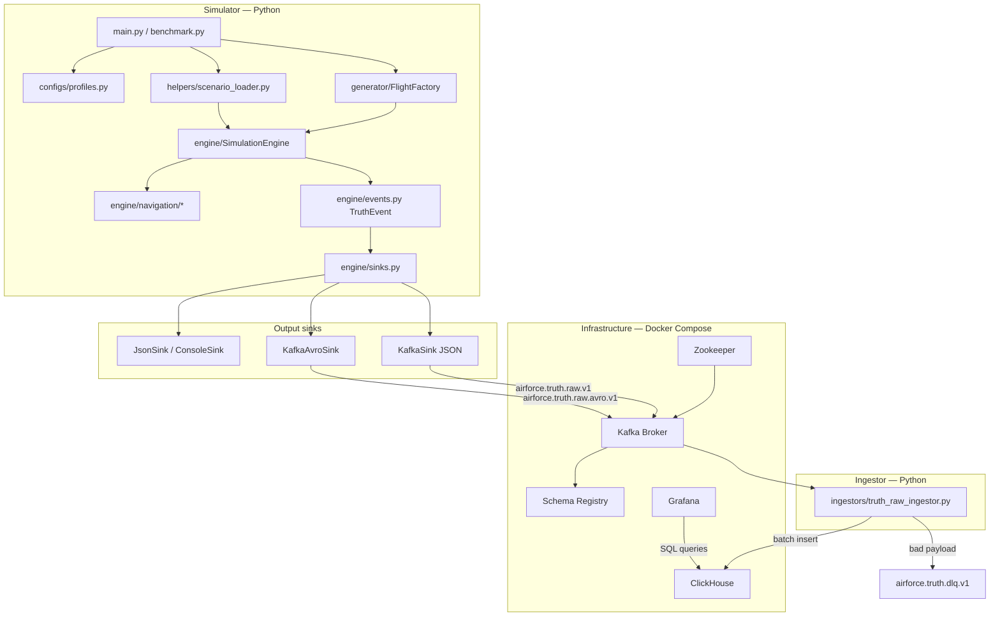
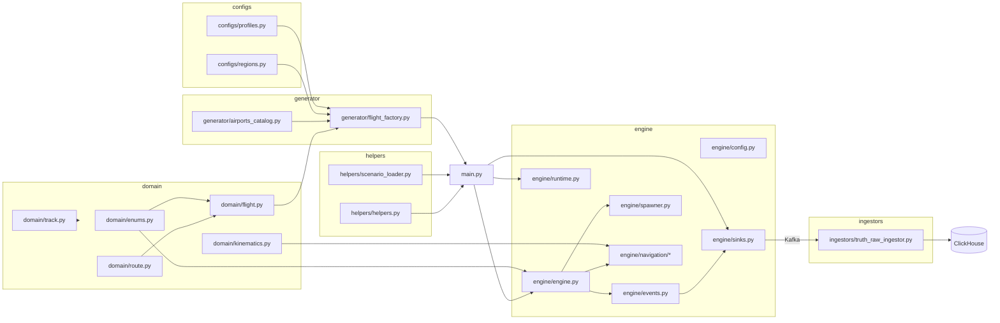

# PROJECT_MAP — airforce_mvp

Карта проекта: архитектура, сервисы, зависимости, точки входа и ключевые файлы.

> **Текущее состояние MVP:** зрелый truth-layer (симуляция мира + canonical event log + Kafka + ClickHouse + replay UI). Avro sink, marts, MinIO/Spark — WIP (см. `graph-memory/SNAPSHOT.md`).

---

## Архитектура

Проект — **симулятор воздушного пространства (truth layer)** и **локальный DE-пайплайн** для записи и анализа событий.



### Поток данных (happy path)

1. **Конфиг + сценарий** — профиль из `configs/profiles.py`, объекты из `FlightFactory` и/или JSON-сценариев.
2. **Симуляция** — `SimulationEngine` двигает объекты, эмитит `TruthEvent` (`spawned` → `position_updated` → `despawned`).
3. **Sink** — события уходят в файл/console/Kafka (JSON или Avro).
4. **Ingestion** — `truth_raw_ingestor` читает Kafka, пишет батчами в ClickHouse.
5. **Analytics** — Grafana читает таблицу `airforce.truth_events_raw`.

### Граница контракта

`TruthEvent` (`engine/events.py`, schema `truth_event_v1`) — единственный канонический контракт между симулятором и downstream-системами. Все изменения схемы проходят через events → sinks → ingestor → ClickHouse migration (+ Avro `.avsc` при необходимости).

---

## Основные сервисы

### Python-процессы (приложение)

| Сервис | Файл | Назначение |
|--------|------|------------|
| **Simulator** | `main.py` | CLI-запуск симуляции: генерация мира, engine loop, sink |
| **Benchmark** | `benchmark.py` | Замеры throughput без realtime pacing |
| **Truth Raw Ingestor** | `ingestors/truth_raw_ingestor.py` | Kafka consumer → нормализация → ClickHouse batch insert |
| **CSV utilities** | `helpers/csv2route.py`, `helpers/csv2track.py` | Импорт маршрутов/треков из CSV |

### Docker Compose (`infrastructure/kafka/docker-compose.yml`)

| Сервис | Порт (host) | Роль |
|--------|-------------|------|
| **Zookeeper** | 2181 | Координация Kafka |
| **Kafka** | 9092 (internal), 9094 (external) | Брокер сообщений |
| **Schema Registry** | 8081 | Avro-схемы для `KafkaAvroSink` |
| **Kafka UI** | 8080 | Просмотр топиков/consumer groups |
| **kafka-init** | — | Создание топиков при старте |
| **ClickHouse** | 8123 (HTTP), 9000 (native) | Хранилище raw truth events |
| **clickhouse-init** | — | Применение SQL-миграций |
| **Grafana** | 3000 | Дашборды поверх ClickHouse |

### Kafka-топики

| Topic | Формат | Producer | Consumer |
|-------|--------|----------|----------|
| `airforce.truth.raw.v1` | JSON | `KafkaSink` | `truth_raw_ingestor` |
| `airforce.truth.raw.avro.v1` | Avro + Schema Registry | `KafkaAvroSink` | `truth_raw_ingestor` |
| `airforce.truth.dlq.v1` | JSON | ingestor (malformed only) | — |

---

## Зависимости между модулями



### Цепочки зависимостей (кратко)

| Цепочка | Путь |
|---------|------|
| **Сценарий → мир** | `profiles.py` → `flight_factory.py` → `scenario_loader.py` → `main.py` |
| **Мир → события** | `navigation/*` → `engine.py` → `events.py` → `sinks.py` |
| **Kafka → хранилище** | `KafkaSink` / `KafkaAvroSink` → topic → `truth_raw_ingestor.py` → `truth_events_raw` |
| **Infra bootstrap** | `docker-compose.yml` → kafka-init + clickhouse-init → `001_create_truth_events_raw.sql` |

### Правила зависимостей

- `domain/` не зависит от `engine/` или `ingestors/`
- `SimulationEngine` — единственный authority по `run_id`, `current_time` и lifecycle-событиям
- Spread `activation_time` и merge сценариев — в `main.py`, не в engine
- JSON и Avro **не смешиваются** в одном топике

---

## Точки входа

### `main.py` — основной runtime

```bash
python main.py --profile debug --sink console
python main.py --profile stream --sink kafka --infinite
python main.py --profile load --sink json --output output/run.json
```

Boot sequence:
1. Parse CLI
2. `build_config(profile)` + runtime overrides
3. `FlightFactory.generate_scenario(...)`
4. Optional merge manual scenarios (`ScenarioLoader`)
5. Init positions, spread `activation_time`, assign navigation policies
6. Create sink (`Helpers.create_sink(...)`)
7. `run_fast()` or `run_realtime()`

### `benchmark.py` — throughput

```bash
python benchmark.py --profile load --sink null
```

Запускает симуляцию без realtime pacing для замера events/sec.

### `ingestors/truth_raw_ingestor.py` — DE consumer

```bash
python ingestors/truth_raw_ingestor.py \
  --bootstrap-servers localhost:9094 \
  --topic airforce.truth.raw.v1 \
  --clickhouse-url http://localhost:8123
```

Поддерживает `--message-format auto|json|avro`. Manual commit offsets только после успешного insert в ClickHouse.

### `helpers/csv2route.py` / `helpers/csv2track.py`

Утилиты подготовки входных данных для manual scenarios (маршруты и playback-треки).

### Infrastructure

```bash
docker compose -f infrastructure/kafka/docker-compose.yml up -d
```

---

## Важные файлы

### Domain — модель мира

| Файл | Содержание |
|------|------------|
| `domain/enums.py` | Таксономия: `ScenarioBucket`, `PlatformClass`, `MissionProfile`, `TruthAffiliation`, … |
| `domain/flight.py` | Рейс с маршрутом, callsign, origin/destination |
| `domain/playback_object.py` | Объект по prerecorded track |
| `domain/route.py` | Маршрут + waypoints |
| `domain/track.py` | Playback track |
| `domain/scenario.py` | Спецификация manual scenario (JSON) |
| `domain/kinematics.py` | Профили движения платформ |
| `domain/air_object.py` | Базовый air object |

### Generator — автогенерация сценария

| Файл | Содержание |
|------|------------|
| `generator/flight_factory.py` | Scheduled/unscheduled traffic, transient objects |
| `generator/airports_catalog.py` | Каталог аэропортов для passenger flights |

### Engine — runtime и события

| Файл | Содержание |
|------|------------|
| `engine/engine.py` | `SimulationEngine` — orchestrator, lifecycle emission |
| `engine/events.py` | `TruthEvent` dataclass, schema `truth_event_v1` |
| `engine/sinks.py` | `JsonSink`, `ConsoleSink`, `KafkaSink`, `KafkaAvroSink`, … |
| `engine/config.py` | Dataclasses конфигурации симуляции |
| `engine/runtime.py` | `run_fast()` / `run_realtime()` |
| `engine/spawner.py` | Spawn/despawn transient phenomena |
| `engine/navigation/route_policy.py` | Движение по маршруту |
| `engine/navigation/random_policy.py` | Случайное блуждание |
| `engine/navigation/playback_policy.py` | Движение по track |

### Helpers — загрузка и утилиты

| Файл | Содержание |
|------|------------|
| `helpers/scenario_loader.py` | Загрузка JSON-сценариев |
| `helpers/helpers.py` | Factory sinks, export dots, cleanup output |
| `helpers/csv2route.py` | CSV → route |
| `helpers/csv2track.py` | CSV → track |

### Configs — профили и география

| Файл | Содержание |
|------|------------|
| `configs/profiles.py` | `debug`, `realtime_demo`, `load`, `stream` |
| `configs/regions.py` | Bounding box Europe + CIS |

### Ingestors + schema + migrations

| Файл | Содержание |
|------|------------|
| `ingestors/truth_raw_ingestor.py` | Kafka → ClickHouse ingestor + DLQ |
| `schemas/avro/truth_event_v1.avsc` | Avro schema для KafkaAvro path |
| `migrations/clickhouse/001_create_truth_events_raw.sql` | DDL таблицы `airforce.truth_events_raw` |
| `infrastructure/kafka/docker-compose.yml` | Полный локальный DE-стенд |

---

## Где что менять

| Задача | Файлы |
|--------|-------|
| Truth schema | `engine/events.py`, `engine/sinks.py`, `ingestors/truth_raw_ingestor.py`, CH migration |
| Avro schema | `schemas/avro/truth_event_v1.avsc`, `engine/sinks.py`, ingestor |
| Генерация мира | `generator/flight_factory.py`, `generator/airports_catalog.py` |
| Поведение движения | `engine/navigation/*`, `domain/kinematics.py` |
| Lifecycle / despawn | `engine/engine.py`, `engine/spawner.py`, `engine/config.py` |
| Startup / CLI | `main.py`, `configs/profiles.py` |
| DE pipeline | `engine/sinks.py`, ingestor, docker-compose, CH migrations |

---

## Профили запуска

| Profile | Назначение |
|---------|------------|
| `debug` | Малый локальный тест |
| `realtime_demo` | Paced run для наблюдения |
| `load` | Throughput без realtime |
| `stream` | Бесконечный realtime stream для Kafka/DE |
| `stream_shard` | Меньший мир на процесс — для кластера генераторов |

Ключевые параметры времени (`engine/config.py`):
- `tick_seconds` — шаг симуляции (точность траектории)
- `time_scale` — множитель realtime pacing
- `max_steps=None` — бесконечный режим

---

## Связанные документы

| Документ | Назначение |
|----------|------------|
| `ROADMAP.md` | План обучения и следующие этапы (start here) |
| `AGENTS.md` | Инструкции для AI-агента |
| Obsidian vault `Projects/airforce_mvp/` | Нумерованные объяснительные заметки |
